# Crypto Derivatives Algorithmic Trading System
- 디지털 자산 파생상품 시장 데이터를 수집하고, 전략 가설을 백테스트와 리스크 관리 기준으로 검증하기 위한 개인 알고리즘 트레이딩 연구/시스템 프로젝트
- 단순 가격 기반 추세추종 전략의 횡보·전환 구간 한계를 분석하고, Price Box와 Open Interest Box를 활용해 거래 가능한 시장 상태를 파악하는 연구를 진행했습니다.

## Summary
- 초기 접근은 MA Crossover 기반 추세추종 전략이었으나, 횡보·전환 구간에서 잦은 신호 전환과 비용 누적이 발생했습니다.
- 문제를 “방향 예측”이 아니라 “거래 가능한 시장 상태 구분”으로 재정의했습니다.
- Price Box와 Open Interest Box를 활용해 range/trend 상태를 구분하고, 저품질 진입을 줄이는 전략을 설계했습니다.
- 백테스트에서는 수수료·슬리피지·스프레드, 손절, 포지션 사이징을 반영했습니다.
- 실시간 데이터 수집, signal pipeline, order intent, pre-trade risk gate, execution gateway 구조까지 구현했습니다.

## Key Result

검증 구간에서 단순 기준 전략 대비 Box 기반 전략 후보가 개선된 성과를 보였습니다.

| Strategy | Total Return | Win Rate | Profit Factor | MDD |
|---|---:|---:|---:|---:|
| MA Crossover baseline | -7.46% | 23% | 0.57 | -7.90% |
| Price Box only | +10~11% | 70%대 | 1.99~2.36 | 약 -1% 미만 |
| Price + OI Box | +9~10% | 70% 이상 | 2.25~2.36 | 약 -1% 미만 |

결과는 제한된 기간의 디지털 자산 데이터 기반이며, 전략의 절대적 수익성을 주장하기보다
관찰 기반 가설을 검증 가능한 전략 구조로 전환한 사례로 제시합니다.

## Reviewer Guide

처음 보시는 경우 아래 순서로 확인하시면 됩니다.

1. Price Box와 Open Interest를 활용한 상태 필터 설계 및 백테스팅  
   [research/notebooks/oi_box_event_strategy_backtest_audit.ipynb](research/notebooks/oi_box_event_strategy_backtest_audit.ipynb)

2. OI Terminal Volatility 전략: OI 박스 종단 부분에 대한 변동성 연구
   [research/notebooks/oi_terminal_volatility_backtest_audit.ipynb](research/notebooks/oi_terminal_volatility_backtest_audit.ipynb)

3. Transient(크게 튄 뒤 원래 상태로 복귀) / Persistent(크게 튄 뒤에도 높은 상태 유지) OI Shock 전략 연구
   [research/notebooks/oi_shock_transient_persistent_backtest_audit.ipynb](research/notebooks/oi_shock_transient_persistent_backtest_audit.ipynb)

4. 주문 프로세스 정리
   [apps/execution_gateway/src/execution_gateway/README_ORDER.md](apps/execution_gateway/src/execution_gateway/README_ORDER.md)

5. 백테스트 엔진  
   [research/microstructure_alpha/box_strategy_backtest.py](research/microstructure_alpha/box_strategy_backtest.py)

6. 주문 전 리스크 관리  
   [apps/execution_gateway/src/execution_gateway/handlers/risk_handler.py](apps/execution_gateway/src/execution_gateway/handlers/risk_handler.py)

7. 실시간 데이터 수집 런타임  
   [apps/collectors/src/exchange/shared/cex_market_data/python/src/cex_market_data_collector/operational_runtime.py](apps/collectors/src/exchange/shared/cex_market_data/python/src/cex_market_data_collector/operational_runtime.py)

## Project Summary

초기 접근은 MA Crossover 기반 가격 추세추종 전략이었습니다. 그러나
횡보장과 전환 구간에서 잦은 신호 전환과 거래 비용 누적이 발생했습니다.
이후 문제를 단순 방향 예측이 아니라 "현재 시장이 거래 가능한 상태인지
구분하는 문제"로 재정의했습니다.

핵심 아이디어는 다음과 같습니다.

- Price Box: 가격이 일정 범위 안에서 유지되는 구간을 자동 탐지
- OI Box: 여러 거래소의 미결제약정이 안정적으로 유지되는 구간을 탐지
- State Filter: 가격 박스와 OI 박스를 함께 사용해 저품질 진입을 줄임
- Risk First Backtest: 수수료, 슬리피지, 스프레드, 손절, 포지션 사이징을 반영

대표 진단 구간에서 MA Crossover baseline은 손실과 큰 drawdown을 보였고,
Box 기반 후보 전략은 더 낮은 drawdown과 높은 Profit Factor를 보였습니다.
이 결과는 미래 수익 보장이 아니라, 특정 데이터 구간에서 관찰한 가설 검증
결과이며 포트폴리오에는 한계와 추가 검증 계획을 함께 명시했습니다.

## Portfolio Mapping

| Portfolio Section | Code / Document | What to Check |
|---|---|---|
| Motivation & Problem Definition | `docs/strategy_research_summary.md` | 추세추종 한계와 문제 재정의 |
| Data Pipeline & Trading Infrastructure | `apps/collectors/`, `packages/storage/` | WebSocket primary, REST fallback, QuestDB/Redis 저장 |
| Market Observation: OI / Price Box | `research/microstructure_alpha/oi_box.py` | Price/OI Box 탐지 로직 |
| Strategy Design & Risk Management | `packages/strategies/`, `risk_handler.py` | Range/Trend mode, SL/TP, position sizing |
| Backtest Protocol & Results | `oi_box_event_strategy_backtest_audit.ipynb` | 비용·리스크 반영 성과 검증 |
| Trading System Implementation | `apps/stream_processor/`, `apps/execution_gateway/`, `apps/api_server/` | Signal → Order Intent → Risk → Execution |

## Execution Gateway Core Files

전략 신호가 실제 주문으로 나가기 전후의 흐름은 아래 파일을 중심으로 확인할 수 있습니다.

| Area | File | What to Check |
|---|---|---|
| Order Intent Consumer | [`order_intent_consumer.py`](apps/execution_gateway/src/execution_gateway/consumers/order_intent_consumer.py) | Redpanda order intent consume → handler chain 연결 |
| Dedup Handler | [`dedup_handler.py`](apps/execution_gateway/src/execution_gateway/handlers/dedup_handler.py) | 중복 주문 intent 방지 |
| Pre-trade Risk Gate | [`risk_handler.py`](apps/execution_gateway/src/execution_gateway/handlers/risk_handler.py) | SL/Entry/TP 구조, 손절 거리 기반 sizing, exposure cap |
| Order Submit Handler | [`order_submit_handler.py`](apps/execution_gateway/src/execution_gateway/handlers/order_submit_handler.py) | risk 통과 intent를 execution gateway로 제출 |
| Gateway Core | [`core.py`](apps/execution_gateway/src/execution_gateway/gateway/core.py) | 주문 생성/취소/상태 조회의 중심 interface |
| Binance Execution Client | [`binance_execution_client.py`](apps/execution_gateway/src/execution_gateway/adapters/binance/binance_execution_client.py) | 거래소 주문 API adapter |
| Order State Service | [`order_state_service.py`](apps/execution_gateway/src/execution_gateway/services/order_state_service.py) | 주문 상태 저장 및 transition 관리 |
| Reconciliation Worker | [`reconciliation_worker.py`](apps/execution_gateway/src/execution_gateway/workers/reconciliation_worker.py) | 내부 주문 상태와 거래소 상태 불일치 보정 |
| User Data Stream | [`binance_user_data_stream.py`](apps/execution_gateway/src/execution_gateway/listeners/binance/binance_user_data_stream.py) | 체결/주문 업데이트 수신 |

## 수집 → 관찰[시그널 탐지] → 전략 → Order Intent 생성 → Order 생성[주문]

```mermaid
flowchart LR
    MD["Market Data<br/>trade / OI"] --> SP["Signal Pipeline"]
    SP --> ST["Price/OI Box Strategy"]
    ST --> SIG["strategy.signals<br/>Signal + Entry/SL/TP"]

    SIG --> WS["WebSocket<br/>/api/ws/signals"]
    WS --> CLIENT["Client<br/>signal 확인"]

    CLIENT --> APPROVE["POST /api/signals/{id}/approve<br/>client가 OrderRequest 작성"]
    APPROVE --> GW1["ExecutionGateway<br/>submit_order"]

    SIG --> OIP["Order Intent Pipeline"]
    OIP --> INTENT["strategy.order_intents"]

    INTENT --> CONSUMER["Order Intent Consumer<br/>ORDER_INTENT_CONSUMER_ENABLED=true"]
    CONSUMER --> DEDUP["Dedup<br/>signal_id 중복 방지"]
    DEDUP --> RISK["Pre-Trade Risk<br/>SL/Entry/TP 검증<br/>position sizing"]
    RISK --> GW2["ExecutionGateway<br/>submit_order"]

    GW1 --> EX["Exchange"]
    GW2 --> EX

    EX --> STATE["Order / Position State<br/>PostgreSQL + Redis"]
```




## Risk Management

전략 신호는 바로 주문으로 전환되지 않습니다.
주문 전 `PreTradeRiskHandler`에서 다음 조건을 확인합니다.

- Long: `SL < Entry < TP`
- Short: `TP < Entry < SL`
- 최소 손절 거리
- 최소 Reward/Risk
- 손절 거리 기반 position sizing
- 최대 leverage / max notional cap
- fee, slippage, spread 반영

## Repository Map
```text
.
├── apps/
│   ├── collectors/          # 거래소 WebSocket/REST 시장 데이터 수집
│   ├── stream_processor/    # Redpanda consume -> QuestDB/Redis 저장
│   ├── execution_gateway/   # 주문 생성, 상태 추적, reconciliation 구조
│   └── api_server/          # 대시보드/API 서버
├── packages/
│   ├── storage/             # QuestDB, Redis, PostgreSQL repository
│   ├── messaging/           # Redpanda/Kafka producer/consumer wrapper
│   ├── risk/                # drawdown, sizing, constraints
│   └── schemas/             # market/order/position schema
└── research/
    ├── microstructure_alpha/# OI/Price Box, event signal, strategy backtest
    ├── backtests/           # cost-aware backtesting utilities
    └── notebooks/           # portfolio/research notebooks
```

## Tech Stack
- Research / Backtest: Python, Pandas, Polars, NumPy, Jupyter
- Stream / Pipeline: Redpanda, Redis, QuestDB, PostgreSQL
- API / Execution: FastAPI, WebSocket, Docker
- Exchange Connectivity: Binance, Bybit, Bitget, OKX WebSocket/REST

### Additional Documents.
1. 이동평균 교차 전략 실효성 연구
   [research/notebooks/moving_average_crossover_failure_audit.ipynb](research/notebooks/moving_average_crossover_failure_audit.ipynb)

2. Dead-cat Bounce Range 전략: 하락 후 반등 레벨의 전략적 유효성 검증
   [research/notebooks/deadcat_bounce_range_backtest_audit.ipynb.ipynb](research/notebooks/deadcat_bounce_range_backtest_audit.ipynb)