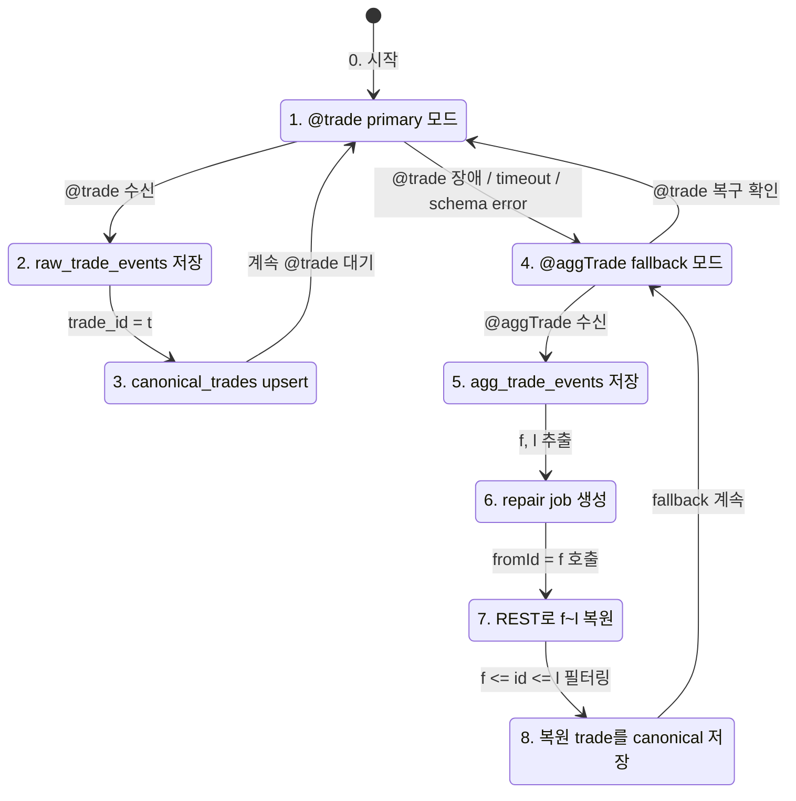
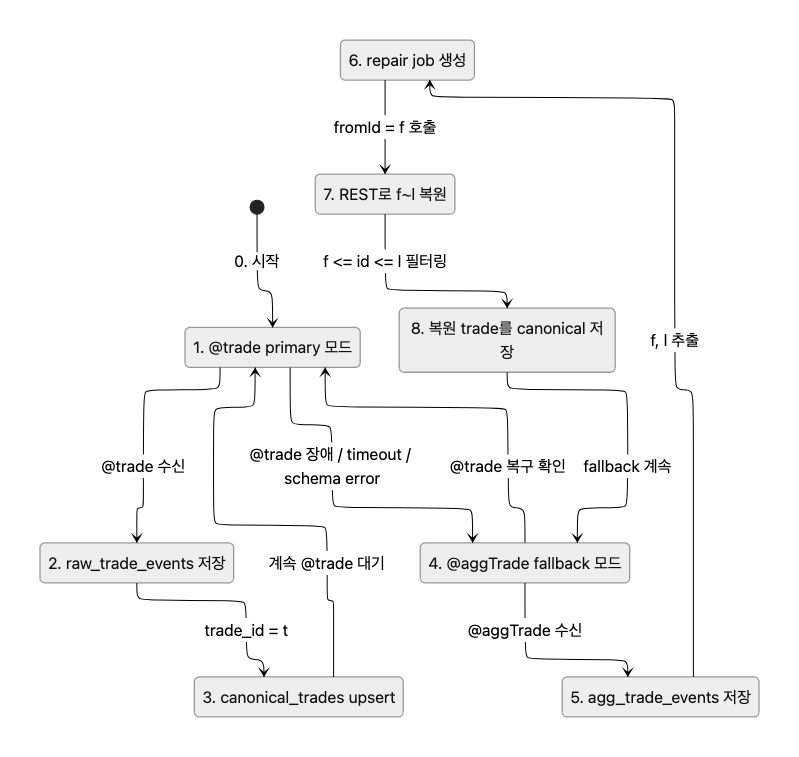
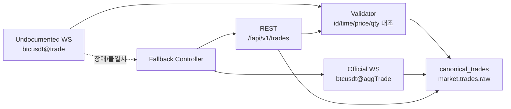
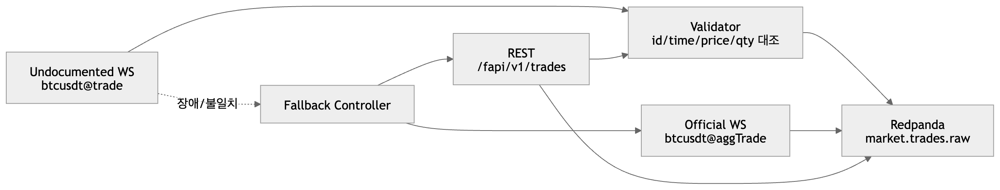
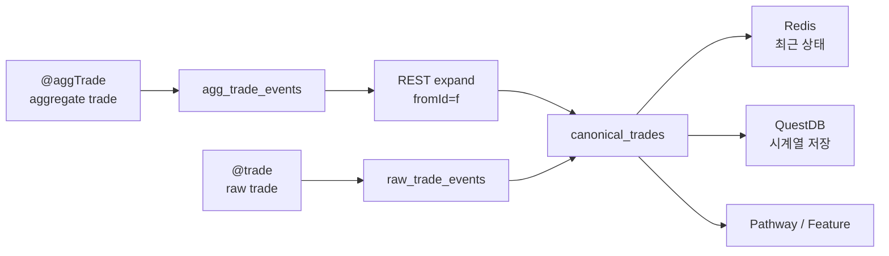
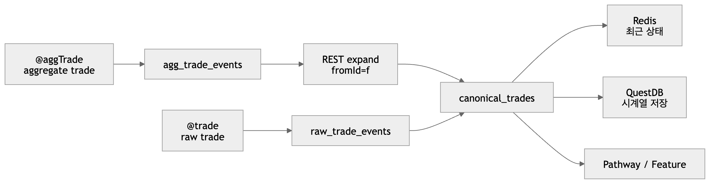

```
flowchart TD
    START["0. 시작"] --> CHECK["1. @trade 상태 확인"]

    CHECK --> OK{"2. @trade 정상?"}

    OK -->|Yes| T1["3A. @trade 수신"]
    T1 --> T2["4A. trade_id = t 추출"]
    T2 --> T3["5A. raw_trade_events 저장"]
    T3 --> T4["6A. canonical_trades upsert"]
    T4 --> T5["7A. 전략 / 피처 엔진 소비"]

    OK -->|No| F1["3B. @aggTrade fallback 전환"]
    F1 --> F2["4B. @aggTrade 수신"]
    F2 --> F3["5B. f = first_trade_id<br/>l = last_trade_id 추출"]
    F3 --> F4["6B. agg_trade_events 저장"]
    F4 --> F5["7B. repair job 생성"]
    F5 --> F6["8B. REST fromId = f 호출"]
    F6 --> F7["9B. f ~ l 범위 개별 trade 필터링"]
    F7 --> F8["10B. canonical_trades upsert"]
    F8 --> F9["11B. 전략 / 피처 엔진 소비"]

    F9 --> RECOVER{"12. @trade 복구됨?"}
    RECOVER -->|No| F2
    RECOVER -->|Yes| CHECK
```
.png>)


- [wss://fstream.binance.com/ws/btcusdt@trade](https://wss://fstream.binance.com/ws/btcusdt@trade)
- [wss://fstream.binance.com/ws/btcusdt@aggTrade](https://wss://fstream.binance.com/ws/btcusdt@aggTrade)
에 대한 전략


# wss://fstream.binance.com/ws/btcusdt@trade

은 현재 실서버에서 동작할 수 있지만, USDⓈ-M Futures 공식 문서상 보장된 표준 스트림으로 보기 어렵다.

Primary:
  fstream @trade 수신
  → raw trade처럼 저장

Validation:
  주기적으로 REST /fapi/v1/trades 와 대조
  → trade id, price, qty, time 비교

Fallback:
  @trade 끊김 / 지연 / schema 변경 감지 시
  → 공식 @aggTrade + REST 보강 모드로 전환





아래 조건을 만족하면 “사용해도 괜찮다”고 봅니다.
1. @trade 수신 지연을 계속 측정한다.
   lag_ms = now_ms - T

2. REST /fapi/v1/trades 와 주기적으로 대조한다.

3. 메시지 schema 변경을 감지한다.
   필수 필드: e, E, s, t, p, q, T, m

4. N초 이상 미수신이면 자동으로 @aggTrade + REST 모드로 전환한다.

5. 저장할 때 source를 명시한다.
   source = "fstream_undocumented_trade"

```json
{
  "exchange": "binance",
  "market_type": "usdm_futures",
  "symbol": "BTCUSDT",
  "source": "fstream_undocumented_trade",
  "event_type": "trade",
  "trade_id": 123456789,
  "price": "65000.12",
  "qty": "0.001",
  "trade_time": 1710000000090,
  "event_time": 1710000000100,
  "is_buyer_maker": false,
  "verified_by_rest": false
}
```

써도 됨:
  빠른 raw trade 관측용

하지만:
  공식 보장 스트림이 아니므로 장애/변경 가능성 있음

운영 권장:
  @trade = 빠른 실시간 후보 데이터
  REST = 검증/보강 데이터
  @aggTrade = 공식 fallback 데이터



