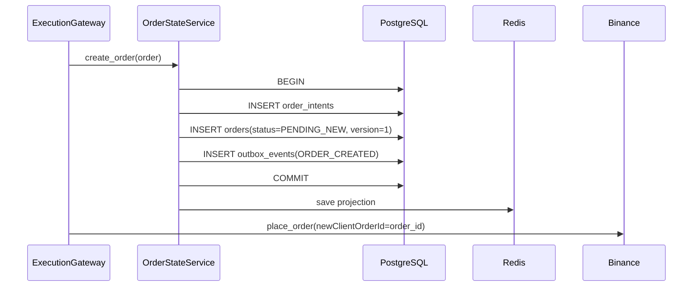

# Order Persistence Design

Takora Execution Gateway의 주문 상태 저장 구조를 설명한다.

이 문서는 다음 저장소들의 역할을 정리한다.

- PostgreSQL
  - 주문 원본 상태
  - 주문 의도
  - 상태 전이 원장
  - Outbox 이벤트

- Redis
  - 빠른 조회용 projection
  - open / recovery / unknown 인덱스

- Redpanda
  - 주문 이벤트 스트림

- QuestDB
  - 체결 execution log

- ClickHouse
  - 장기 분석 / 리서치

---

## 주문 관련 PostgreSQL 테이블

### order_intents

- order_intents는 주문의 최초 의도를 저장
- 이 테이블은 주문이 왜, 어떤 조건으로, 어떤 전략에 의해 만들어졌는지를 보관
- order_intents는 기본적으로 거의 불변에 가깝다.
- 주문이 체결되거나 취소되어도, 최초 의도 자체는 바뀌지 않는다.

**역할**

```
- 주문 생성 의도 저장
- 전략 메타데이터 저장
- Redis projection 복구 시 필요한 정적 필드 제공
- 거래소에는 주문이 있는데 Redis에 없을 때 우리 주문인지 판단하는 기준
```

**대표 칼럼**
| 컬럼 | 의미 |
| --------------- | ----------------------------------------- |
| `order_id` | 내부 주문 ID. Binance `newClientOrderId`로도 사용 |
| `source` | `MANUAL`, `STRATEGY` 등 주문 생성 출처 |
| `signal_id` | 주문을 만든 signal ID |
| `strategy_name` | 주문을 만든 전략 이름 |
| `exchange` | 거래소 |
| `market_type` | spot, perp 등 시장 유형 |
| `symbol` | BTCUSDT 같은 거래 심볼 |
| `side` | BUY / SELL |
| `order_type` | LIMIT / MARKET 등 |
| `time_in_force` | GTC 등 |
| `quantity` | 주문 수량 |
| `price` | 주문 가격 |
| `stop_price` | stop 주문 가격 |
| `reduce_only` | reduce only 여부 |
| `created_ts` | 주문 의도 생성 시각 |
| `raw_request` | 최초 요청 원본 JSON |

### orders

- orders는 주문의 현재 상태를 저장한다.
- 이 테이블은 해당 주문이 지금 어떤 상태인지, 거래소 주문 ID가 무엇인지, 얼마나 체결됐는지 등을 보관한다.

**역할**

```
- 주문의 authoritative current state 저장
- 상태 전이 원본
- Redis projection 생성 기준
- Recovery / Reconciliation의 기준 상태
```

**대표 칼럼**
| 컬럼 | 의미 |
| ------------------- | --------------- |
| `order_id` | 내부 주문 ID |
| `status` | 현재 주문 상태 |
| `exchange_order_id` | Binance orderId |
| `reject_reason` | 거부 사유 |
| `filled_quantity` | 누적 체결 수량 |
| `avg_fill_price` | 평균 체결가 |
| `created_ts` | 생성 시각 |
| `submitted_ts` | 거래소 제출 시각 |
| `filled_ts` | 최종 체결 시각 |
| `updated_ts` | 마지막 상태 변경 시각 |
| `version` | 상태 변경 버전 |

### outbox_events

- outbox_events는 PostgreSQL 상태 변경과 같은 트랜잭션 안에서 기록되는 이벤트 테이블
- outbox_events에 기록만 하고, 이후 OutboxPublisher가 이 테이블을 읽어 Redpanda로 발행

**역할**

- 주문 상태 변경 이벤트를 잃지 않기 위한 outbox
- Redpanda 발행 대기 큐
- 이벤트 발행 실패 시 재시도 기준

**대표 칼럼**
| 컬럼 | 의미 |
| ---------------- | ----------------------------------------- |
| `event_id` | 이벤트 ID |
| `aggregate_type` | 보통 `ORDER` |
| `aggregate_id` | order_id |
| `event_type` | `ORDER_CREATED`, `ORDER_STATUS_CHANGED` 등 |
| `payload` | 이벤트 본문 JSON |
| `created_ts` | 이벤트 생성 시각 |
| `published_ts` | Redpanda 발행 완료 시각 |
| `retry_count` | 발행 재시도 횟수 |
| `last_error` | 마지막 발행 오류 |

## 주문 관련 Redis 테이블

- Redis는 원본 저장소가 아니라 빠른 조회용 projection
- order:open은 활성 주문 order_id 집합으로 정의되어 있고, order:unknown, order:recovery는 복구 대상 인덱스로 분리되어 있어. 또한 save()와 transition_status()에서 terminal 상태가 되면 세 인덱스에서 제거하고, non-terminal이면 order:open에 넣고, UNKNOWN이나 recovery 대상 상태는 updated_ts를 score로 ZSet에 넣는 구조

**주문 projection 다음 키들을 사용**

- order:live:{order_id}
- order:open
- order:unknown
- order:recovery

### order:live:{order_id}

- 주문 하나의 최신 상태를 Redis Hash로 저장

**Ex**

```
order:live:ORD-123
  order_id = ORD-123
  symbol = BTCUSDT
  status = ACKNOWLEDGED
  version = 3
  quantity = 0.1
  price = 60000
```

### order:open

- terminal 상태가 아닌 주문 ID를 저장하는 Set -> 현재 active/open 상태인 주문 ID 전체 집합
- 단순 멤버십 확인 / 전체 active 주문 집합 → Set이면 충분

**필요 연산**

```
- 이 주문이 open인가?
- 현재 open 주문 전체는?
- terminal 되면 open에서 제거
- non-terminal이면 open에 추가
```

- Takora 내부에서는 다음 상태들을 모두 active/open 계열

```
PENDING_NEW
SUBMITTED
ACKNOWLEDGED
PARTIALLY_FILLED
PENDING_CANCEL
UNKNOWN
```

- terminal 상태가 되면 order:open에서 제거

```
FILLED
CANCELLED
REJECTED
EXPIRED
```

### order:unknow

- `UNKNOWN` 상태 주문만 저장하는 ZSet
- "오래된 것부터" 또는 "특정 시간 이전 것만" 뽑아야 함 → ZSet이 필요
- 주문은 단순히 “목록 전체”가 아닌 **UNKNOWN 상태로 오래 머문 주문부터 확인**
- score는 보통 updated_ts 다.
  예를 들어 방금 막 UNKNOWN 된 주문은 거래소 반영 지연이나 UDS 이벤트가 곧 올 수도 있어.
- 그래서 바로 조회하기보다: updated_ts 기준으로 2초 이상 지난 UNKNOWN만 조회

**용도**

- 503 Unknown
- timeout
- 주문 결과 불명
- 나중에 get_order로 실제 상태 확인

**EX**

```
order:unknown
  ORD-123 -> updated_ts
```

### order:recovery

- 복구 확인이 필요한 주문을 저장하는 ZSet->"복구 대상 전체"가 아니라 "updated_ts 기준으로 오래된 복구 대상만" 가져오기
- 대상 상태가 SUBMITTED, PENDING_CANCEL, UNKNOWN 상태들은 오래 머물면 이상한 상태

- 발생 상황 정리

```
SUBMITTED
= 거래소에 보냈는데 ACK가 아직 안 옴

PENDING_CANCEL
= 취소 요청했는데 최종 CANCELLED 확인이 안 됨

UNKNOWN
= 주문 결과가 불명확함
```

-> RecoveryWorker는 이 인덱스를 보고 오래된 주문을 단건 get_order()로 확인

### 상태별 Redis 인덱스 정리

| 상태               | `order:open` | `order:unknown` | `order:recovery` |
| ------------------ | -----------: | --------------: | ---------------: |
| `PENDING_NEW`      |            O |               X |                X |
| `SUBMITTED`        |            O |               X |                O |
| `ACKNOWLEDGED`     |            O |               X |                X |
| `PARTIALLY_FILLED` |            O |               X |                X |
| `PENDING_CANCEL`   |            O |               X |                O |
| `UNKNOWN`          |            O |               O |                O |
| `FILLED`           |            X |               X |                X |
| `CANCELLED`        |            X |               X |                X |
| `REJECTED`         |            X |               X |                X |
| `EXPIRED`          |            X |               X |                X |

## version 필드

- orders.version은 주문 상태 변경마다 증가

- 사용 목적

```
- PostgreSQL optimistic lock
- Redis stale overwrite 방지
- 늦게 도착한 projection update 무시
```

```
v1 PENDING_NEW
v2 SUBMITTED
v3 ACKNOWLEDGED
v4 PARTIALLY_FILLED
v5 FILLED
```

- Redis는 이를 무시해야 한다. -> 그래서 Redis projection 갱신은 다음 규칙을 따른다. -> incoming_version > current_version 인 경우만 반영

## 주문 생성 흐름



### 상태 전이 흐름

```
sequenceDiagram
    participant G as ExecutionGateway
    participant S as OrderStateService
    participant PG as PostgreSQL
    participant R as Redis

    G->>S: transition_order(current_order, updated_order)
    S->>PG: BEGIN
    S->>PG: UPDATE orders SET status=?, version=version+1 WHERE version=expected
    S->>PG: INSERT outbox_events(ORDER_STATUS_CHANGED)
    S->>PG: COMMIT
    S->>R: upsert_projection_if_newer(order)
```
