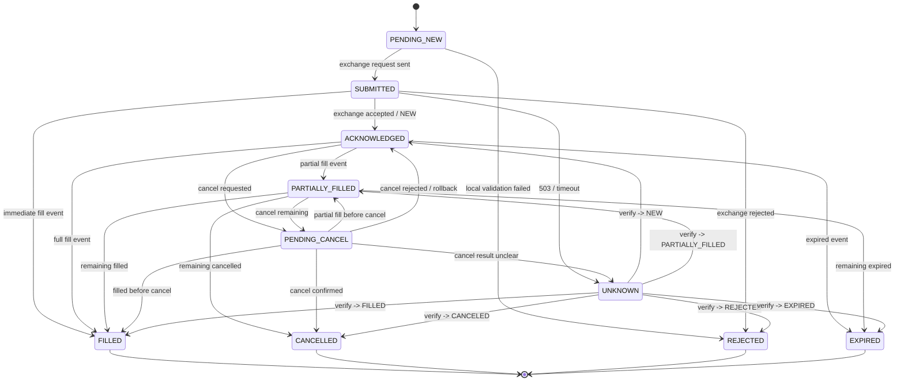
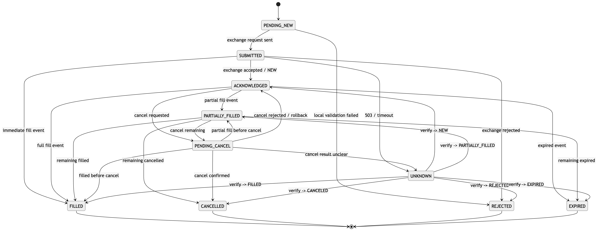

# 주문 상태 정리

PENDING_NEW = "PENDING_NEW"  # Gateway가 주문 요청을 받았지만, 아직 거래소에 전송하지 않은 상태.
SUBMITTED = "SUBMITTED"  # 거래소로 주문 실제 요청을 보낸 상태 -> 이 상태는 “거래소에 보냈다”이지, “거래소가 받아줬다”는 아님.
ACKNOWLEDGED = "ACKNOWLEDGED"  # 거래소가 주문을 정상 접수했고, exchange order id를 부여한 상태.
PARTIALLY_FILLED = "PARTIALLY_FILLED" #주문 수량 중 일부만 체결된 상태.
FILLED = "FILLED" # 주문 전체 수량이 완전히 체결된 상태.
PENDING_CANCEL = "PENDING_CANCEL" #취소 요청을 보냈거나 보내기 직전인 상태.
CANCELLED = "CANCELLED" #주문이 취소 완료된 상태.
REJECTED = "REJECTED" #거래소 또는 내부 시스템이 주문을 거부한 상태.
EXPIRED = "EXPIRED" #주문이 거래소 규칙에 의해 만료된 상태.
UNKNOWN = "UNKNOWN"  # 주문 실행 결과를 모르는 상태.

### ExecutionGateway 내부 상태 전이도

